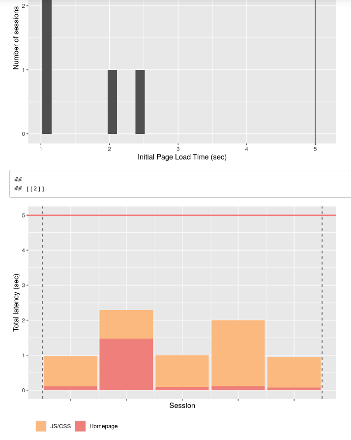
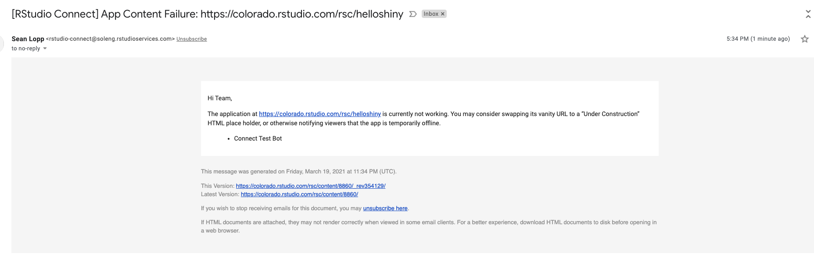

# Continuous Testing of Shiny Apps

It can be very annoying if a user discovers that a shiny application is broken! To prevent this scenario, you can proactively test your shiny app on a regular interval using `test-app.Rmd`.

This document works by helping you create a recording of how your app should work, and then replaying that recording to test if the app is still working. The recording is done once. The replay can be done anytime you want by re-rendering the report. Automating the test is easy by publishing and scheduling this test RMD on RStudio Connect. Everything is powered by a unique use of the [`shinyloadtest`](https://rstudio.github.io/shinyloadtest/) package.

If the test is successful, this RMD displays some simple timing information to create a record of how your app is responding:

If the app test fails, this RMD sends you an email alerting you to the problem:

To see everything in action, visit: <https://colorado.rstudio.com/rsc/connect/#/apps/8860/access/4459>

Look at the report rendering history `click (...) then History` to see examples of failure and success.

### Future Improvements

-   Test that this works with apps that require an RSC API key for access, perhaps using the RSC 1.8.8 built-in Connect API key functionality

-   Perhaps have the the RMD take an action if the content fails, for instance:

    -   Report more details on what part of the play back recording failed, and include in email  

    -   Really cool: hot swap the failing content's vanity URL to a "Under Construction" page w/ the same ACLs using `connectapi`

-   Consider high latencies failure?

-   Instead of checking for any failure, show how many playbacks failed in case it was a temporary hiccup.
